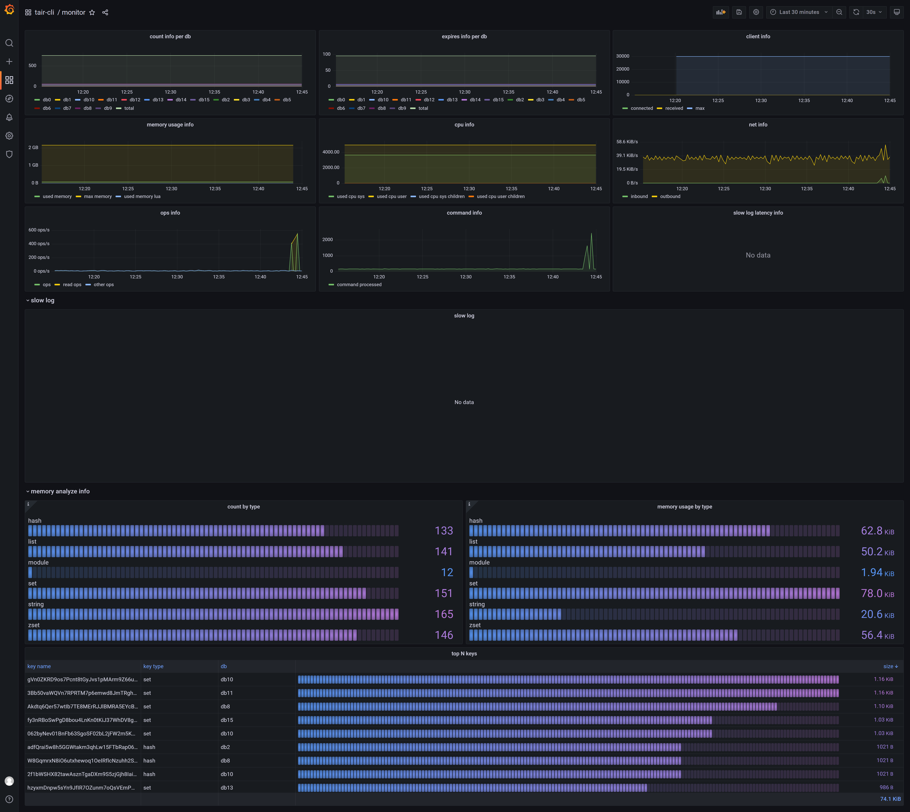

# tair-cli
Code for Tair Hackathon

1. tair-cli
2. tair-monitor

## tair-cli 是什么

tair-cli是一个命令行工具，能在线分析tair中保存的数据。并支持对数据进行如下转换

1. 将tair中的数据转通过scan等命令换为标准redis中的rdb
2. 将tair中的数据转换为jsonl格式
3. 将tair中的数据转换为标准redis的dump格式
4. 将tair中的数据转换为标准redis的resp格式
5. 分析tair中的数据，导出大key的jsonl格式
6. 分析tair中各种类型的key个数

## tair-cli 解决哪些痛点

#### 已知问题

1. tair中目前下载的备份文件是 `rdb version 9`的，不能被低版本的redis直接加载
2. tair中如果使用企业级数据结构 `TairZset`， `TairDoc`等，制作的备份文件同样不能被redis 5.0加载（没加载相应module）
3. 不能设置过滤条件，根据指定的key， db， type生成一个较小的备份文件
4. redis中高版本的rdb文件不能迁移到低版本中，比如`RDB_TYPE_LIST_QUICKLIST`类型不能迁移到`rdb version 6`中

#### tair-cli 如何解决上述问题

一个例子 

```shell
# 生成一个标准rdb ver 6 的文件
$ tair-cli rdb --source redis://host:port?authPassword=pass --rdb-version 6 --convert --db 0 > dump.rdb
$ /path/to/redis-2.8.24/src/redis-check-dump dump.rdb

```

1. 针对问题1，可以设置`--rdb-version` 生成指定版本的rdb文件
2. 针对问题2，可以设置`--convert` 将企业级数据结构转为普通结构（TairString转换为String， 会丢失version等信息）
3. 针对问题3，可设置`--key`, `--db`, `--type`等过滤条件，生成指定数据的rdb
4. 针对问题4，可以将`RDB_TYPE_LIST_QUICKLIST`转换为低版本支持的`RDB_TYPE_LIST`

#### tair-cli 的实现原理

1. 利用scan命令，以及dump和memory usage命令，得到每个key的dump格式与内存占用
2. 根据db，key，type 进行数据过滤
3. 解析dump格式，进行各种转换（jsonl，memory，resp，dump，rdb)，分析dump如果使用了企业级结构，将这些结构转为普通结构。

#### tair-cli 的优化空间

1. tair不支持用户发送psync，sync等命令。如果能使用上述命令，可以避免scan的全库扫描
2. 支持进度条
3. 更好的支持企业级结构，现在比较好的支持将TairString转String，TairZSet转ZSet，TairHash转Hash，TairDoc转String，其他企业结构转换为binary的String.
4. 支持大Key的转换

#### tair-cli 命令使用实例

```shell
# 生成rdb
$ tair-cli rdb --source redis://host:port --key user.* --db 1 2 --type string --rdb-version 7 --convert > dump.rdb

# 查看db1与db2中string类型的个数
$ tair-cli count --source redis://host:port --key user.* --db 1 2 --type string

# 生成jsonl
$ tair-cli jsonl --source redis://host:port --key user.* --db 1 --type hash > dump.jsonl

# 分析memory(key 大于 1024 bytes的top 10 数据)
$ tair-cli memory --source redis://host:port --bytes 1024 --limit 10 > memory.jsonl

# 转换成resp格式的aof
$ tair-cli resp --source redis://host:port --convert --replace > resp.aof

# 转换成dump格式的aof
$ tair-cli dump --source redis://host:port --rdb-version 6 --convert --replace > dump.aof
```

#### 登录目标 redis

```shell
$ tair-cli resp --source redis://host:port?authPassword=pass --convert --replace > resp.aof

# 当pass含有特殊字符比如 @ 等，需要进行url encode
# 例如：pass = 8*@a~
$ tair-cli resp --source redis://host:port?authPassword=8*%40a~ --convert --replace > resp.aof
```

#### tair-cli 命令行帮助

* tair-cli help

```shell

$ tair-cli help
tair-cli [--version] --source <source> [--db <num>...]... [--key <regex>...]...
         [--type <type>...]... [COMMAND]
Options:
      --db <num>...       Database number. multiple databases can be provided.
                            if not specified, all databases will be returned.
      --key <regex>...    Keys to export. this can be a regex. if not
                            specified, all keys will be returned.
      --source <source>   Source uri. eg: redis://host:port?authPassword=foobar.
      --type <type>...    Data type to export. possible values are: string,
                            hash, set, sortedset, list, module, stream.
                            multiple types can be provided. if not specified,
                            all data types will be returned.
      --version           Print version information and exit.
Commands:
  help    Displays help information about the specified command
  rdb     Convert source to rdb format.
  resp    Convert source to resp format
  dump    Convert source to dump format.
  memory  Analyze source memory and output to jsonl format.
  jsonl   Convert source to jsonl format.
  count   Count numbers of key in redis.

```

* tair-cli help \<subcommand\>

```shell

$ tair-cli help rdb
tair-cli rdb [--convert] [--rdb-version <num>] --source <source> [--db
             <num>...]... [--key <regex>...]... [--type <type>...]...
Description: Convert source to rdb format.
Options:
      --convert             Whether convert tair module to normal data
                              structure.
      --db <num>...         Database number. multiple databases can be
                              provided. if not specified, all databases will be
                              returned.
      --key <regex>...      Keys to export. this can be a regex. if not
                              specified, all keys will be returned.
      --rdb-version <num>   Generate rdb version from 6 to 10. if not
                              specified, use the source rdb version.
      --source <source>     Source uri. eg: redis://host:port?
                              authPassword=foobar.
      --type <type>...      Data type to export. possible values are: string,
                              hash, set, sortedset, list, module, stream.
                              multiple types can be provided. if not specified,
                              all data types will be returned.

```
## tair-monitor 是什么

tair-monitor同样是个命令行工具，在线分析tair的运行情况，并汇总到grafana。

```shell
$ cd /path/to/tair-cli/dashboard
$ docker-compose up -d 
$ cd ../bin
$ ./tair-monitor --source redis://host:port

# 打开浏览器http://localhost:3000/d/monitor/monitor. 用户名tair-cli， 密码tair-cli登录grafana 查看监控信息
```

